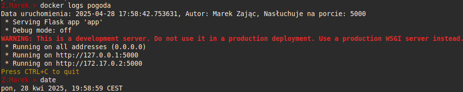

# Zadanie 1 – Aplikacja pogodowa w kontenerze Docker


## Autor
**Marek Zając**

## Linki
- GitHub repozytorium: [https://github.com/Evilnetr0n07/zadanie1](https://github.com/Evilnetr0n07/zadanie1)
- DockerHub obraz: [https://hub.docker.com/repository/docker/username275/weather-app/general](https://hub.docker.com/repository/docker/username275/weather-app/general)

## 1. Opis aplikacji
Aplikacja w Pythonie (Flask) umożliwia wybór miasta i kraju z listy oraz prezentuje pogodę. Po uruchomieniu loguje datę startu, autora i port.

## 2. Dockerfile
Zawiera dwa etapy: pierwszy w którym pobierane są zależności oraz drugi, w którym kopiowane są wymagane pliki oraz wykonany jest test healthcheck

## 3. Polecenia
Budowanie obrazu z tagiem
```bash
docker build -t username275/weather-app .
```


Uruchomienie kontenera z zbudowanego wcześniej obrazu na porcie 5000 o nazwie pogoda
```bash
docker run -d -p 5000:5000 --name pogoda username275/weather-app
```


Sprawdzenie logów
```bash
docker logs pogoda
```


Sprawdzenie liczby warstw i rozmiaru obrazu
```bash
docker history username275/weather-app
docker image inspect username275/weather-app --format='{{.Size}}'
```


